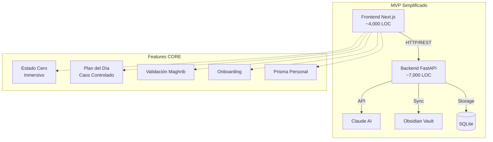
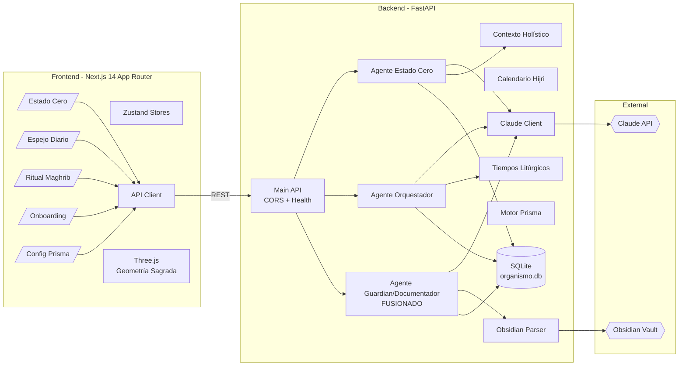
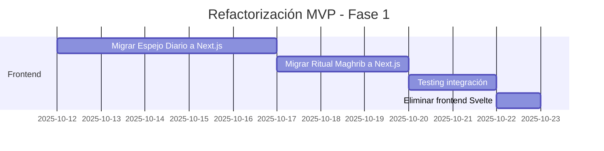

# 🏛️ AUDITORÍA ARQUITECTÓNICA - CAMPO SAGRADO MVP

**Fecha**: 2025-10-11
**Arquitecto**: Sistema de Análisis Arquitectónico
**Objetivo**: Refactorización hacia MVP de excelencia manteniendo filosofía core

---

## 📊 RESUMEN EJECUTIVO

### Métricas Actuales

| Métrica | Valor | Estado |
|---------|-------|--------|
| **LOC Total** | ~30,000 | ⚠️ Excesivo |
| **Backend (Python)** | ~13,000 | ✅ Bien estructurado |
| **Frontend Next.js** | ~3,330 | ✅ Compacto |
| **Frontend Svelte** | ~13,305 | ⚠️ Duplicación con Next.js |
| **Duplicación estimada** | ~60% | 🔴 Crítico |
| **Agentes backend** | 4 | ✅ Óptimo |
| **Endpoints API** | 12+ | ⚠️ Puede reducirse |
| **Componentes frontend** | 60+ | ⚠️ Redundantes |

### Hallazgos Clave

1. **✅ Filosofía Core Sólida**: Waḥdat al-wujūd, Ley de Octava, Autoridad Sacral bien implementadas
2. **🔴 Duplicación Frontend Crítica**: 2 frontends implementan las mismas features (~60% solapamiento)
3. **⚠️ Complejidad Innecesaria**: Múltiples vistas no MVP (Universo Imaginal 3D, Ley de Octava compleja)
4. **✅ Backend Bien Diseñado**: Agentes modulares, servicios cohesivos
5. **⚠️ Integraciones Incompletas**: Google Calendar comentado, Anytype sin uso real

---

## 1. INVENTARIO COMPLETO

### 1.1 Backend (Python/FastAPI) - 13,000 LOC

#### Agentes Core (2,199 LOC)

| Archivo | LOC | Dependencias | Propósito | Complejidad |
|---------|-----|--------------|-----------|-------------|
| `agentes/estado_cero.py` | 331 | Claude, DB, Contexto | Consulta sacral con preguntas binarias | Media |
| `agentes/orquestador.py` | 670 | Claude, Tiempos, DB | Plan del día al borde del caos | Alta |
| `agentes/guardian.py` | 227 | Claude, DB | Reportes diarios y monitoreo | Baja |
| `agentes/entrelazador.py` | 645 | Perfil, Claude, Propósitos | Dashboard entrelazamiento semanal | Media |
| `agentes/documentador.py` | 326 | Obsidian, Claude | Documentación automática | Media |

**Análisis**: 4 agentes bien diferenciados. Documentador puede fusionarse con Guardian.

#### Endpoints API (4,633 LOC)

| Archivo | LOC | Endpoints | Propósito | Criticidad MVP |
|---------|-----|-----------|-----------|----------------|
| `api/main.py` | 241 | 5 | Health, tiempos, verificación | ✅ CORE |
| `api/estado_cero.py` | 491 | 6 | Estado Cero completo | ✅ CORE |
| `api/orquestador.py` | 262 | 4 | Plan del día | ✅ CORE |
| `api/ritual_maghrib.py` | 336 | 3 | Validación Maghrib | ✅ CORE |
| `api/entrelazamiento.py` | 338 | 5 | Dashboard entrelazamiento | ⚠️ FASE 2 |
| `api/estructura.py` | 173 | 2 | Estructura día base | ✅ CORE |
| `api/espejo_diario.py` | 176 | 3 | Plan visible en tiempo real | ✅ CORE |
| `api/vistas_temporales.py` | 202 | 3 | Vista semanal/anual | ⚠️ FASE 2 |
| `api/universo_imaginal.py` | 359 | 6 | Visualización 3D conocimiento | ❌ FASE 3 |
| `api/octavas.py` | 315 | 5 | Ley de la Octava | ⚠️ FASE 2 |
| `api/manifestaciones.py` | 326 | 4 | Tracking manifestaciones | ❌ FASE 3 |
| `api/calendario.py` | 391 | 7 | Google Calendar (comentado) | ⚠️ INCOMPLETO |
| `api/configuracion.py` | 351 | 6 | Config Prisma Personal | ✅ CORE |
| `api/guardian.py` | 273 | 3 | Salud sistema | ⚠️ FASE 2 |

**Análisis**:
- **CORE (MVP)**: 7 archivos, ~1,800 LOC
- **FASE 2**: 4 archivos, ~1,200 LOC
- **FASE 3 / INCOMPLETO**: 3 archivos, ~1,100 LOC

#### Servicios (4,500 LOC)

| Archivo | LOC | Propósito | Criticidad |
|---------|-----|-----------|-----------|
| `services/tiempos_liturgicos.py` | 300 | Cálculo astronómico rezos | ✅ CORE |
| `services/calendario_hijri.py` | 622 | Calendario islámico 12 lunas | ✅ CORE |
| `services/claude_client.py` | 172 | Wrapper Claude API | ✅ CORE |
| `services/contexto.py` | 68 | Recopilador contexto holístico | ✅ CORE |
| `services/sumario_contexto.py` | 388 | Context incremental día | ✅ CORE |
| `services/motor_prisma.py` | 816 | Configuración Prisma Personal | ✅ CORE |
| `services/propositos.py` | 292 | Propósitos día/momento | ✅ CORE |
| `services/obsidian_parser.py` | 363 | Integración Obsidian | ⚠️ FASE 2 |
| `services/gestor_octavas.py` | 524 | Gestión Ley de Octava | ⚠️ FASE 2 |
| `services/universo_processor.py` | 339 | Procesador Universo Imaginal | ❌ FASE 3 |
| `services/metabolizador_metadatos.py` | 366 | Metabolizador conocimiento | ❌ FASE 3 |
| `services/rate_limiter.py` | 98 | Rate limiting APIs | ✅ CORE |
| `services/auth.py` | 152 | Autenticación básica | ⚠️ FUTURO |

**Análisis**:
- **CORE**: 8 archivos, ~2,700 LOC
- **FASE 2**: 3 archivos, ~1,275 LOC
- **FASE 3**: 2 archivos, ~705 LOC

#### Modelos (1,691 LOC)

| Archivo | LOC | Propósito | Criticidad |
|---------|-----|-----------|-----------|
| `models/schemas.py` | 472 | Pydantic schemas completos | ✅ CORE |
| `models/database.py` | 103 | Setup SQLAlchemy | ✅ CORE |
| `models/prisma_personal.py` | 435 | Modelos Prisma Personal | ✅ CORE |
| `models/ley_octava.py` | 536 | Modelos Ley de Octava | ⚠️ FASE 2 |
| `models/universo.py` | 143 | Modelos Universo Imaginal | ❌ FASE 3 |

**Análisis**: Modelos bien estructurados. Separación clara.

---

### 1.2 Frontend Next.js - 3,330 LOC

| Archivo | LOC | Propósito | Criticidad |
|---------|-----|-----------|-----------|
| `app/estado-cero/page.tsx` | 435 | Estado Cero inmersivo | ✅ CORE |
| `app/estado-cero/components/PreguntasSacrales.tsx` | ~200 | Componente preguntas | ✅ CORE |
| `app/estado-cero/components/UniversoEsferico.tsx` | ~300 | Geometría sagrada 3D | ✅ CORE |
| `app/estado-cero/validacion/page.tsx` | ~150 | Validación calendario | ✅ CORE |
| `app/onboarding/page.tsx` | ~200 | Wizard onboarding | ✅ CORE |
| `app/onboarding/components/*` | ~600 | 4 pasos wizard | ✅ CORE |
| `app/page.tsx` | ~100 | Home/Dashboard | ✅ CORE |
| `lib/api-client.ts` | ~300 | Cliente API | ✅ CORE |
| `lib/stores/*.ts` | ~200 | Zustand stores | ✅ CORE |
| `lib/momento-config.ts` | ~150 | Config momentos | ✅ CORE |

**Total Next.js**: ~3,330 LOC - TODO CORE MVP

**Análisis**: Frontend compacto, bien estructurado, enfocado en Estado Cero inmersivo. ✅ Mantener.

---

### 1.3 Frontend Svelte - 13,305 LOC

#### Componentes (19 archivos)

| Archivo | LOC | Propósito | Duplicado con Next.js |
|---------|-----|-----------|----------------------|
| `EstadoCero/ConsultaSacral.svelte` | ~200 | Preguntas sacrales | ✅ SÍ |
| `EstadoCero/ConsultaSacralMejorada.svelte` | ~250 | Versión mejorada | ✅ SÍ |
| `EstadoCero/EsferaCuboMeditacion.svelte` | ~400 | Geometría 3D | ✅ SÍ |
| `EstadoCero/ChatClarificador.svelte` | ~150 | Chat clarificación | ✅ SÍ |
| `EstadoCero/ContextoDisplay.svelte` | ~100 | Display contexto | ⚠️ Parcial |
| `EstadoCero/VerificacionMomento.svelte` | ~80 | Verificar momento | ⚠️ Parcial |
| `EspejoDiario/JornadaCaos.svelte` | ~300 | Plan del día | ❌ NO |
| `EspejoDiario/NoNegociables.svelte` | ~150 | No-negociables | ❌ NO |
| `EspejoDiario/EspejoDinamico.svelte` | ~200 | Espejo vivo | ❌ NO |
| `EspejoDiario/ChatbotAclaraciones.svelte` | ~120 | Chat orquestador | ❌ NO |
| `Octavas/DashboardOctavas.svelte` | ~250 | Dashboard Octavas | ⚠️ FASE 2 |
| `Octavas/EspiralOctavas.svelte` | ~300 | Visualización espiral | ⚠️ FASE 2 |
| `Dimensiones/VistaDimensiones.svelte` | ~200 | 7 Dimensiones Ser | ⚠️ FASE 2 |
| `Vistas/VistaSemanal.svelte` | ~250 | Vista semanal | ⚠️ FASE 2 |
| `Vistas/VistaAnual.svelte` | ~280 | Vista anual (12 lunas) | ⚠️ FASE 2 |
| `Shared/GeometriaSagrada.svelte` | ~180 | Geometría compartida | ✅ CORE |
| `Shared/TiempoLiturgico.svelte` | ~120 | Display tiempos | ✅ CORE |
| `Shared/Navegacion.svelte` | ~100 | Navegación | ✅ CORE |

#### Rutas (15 páginas)

| Ruta | LOC | Propósito | Criticidad |
|------|-----|-----------|-----------|
| `/estado-cero/+page.svelte` | 580 | Estado Cero completo | ✅ Duplicado Next.js |
| `/espejo-diario/+page.svelte` | ~400 | Plan del día | ✅ CORE (único) |
| `/espejo-diario-vivo/+page.svelte` | ~350 | Plan live updates | ✅ CORE (único) |
| `/ritual-maghrib/+page.svelte` | ~300 | Validación Maghrib | ✅ CORE |
| `/ley-octava/+page.svelte` | ~350 | Dashboard Octavas | ⚠️ FASE 2 |
| `/vista-semanal/+page.svelte` | ~200 | Vista semanal | ⚠️ FASE 2 |
| `/vista-anual/+page.svelte` | ~250 | Vista anual | ⚠️ FASE 2 |
| `/universo-imaginal/+page.svelte` | ~450 | Universo 3D | ❌ FASE 3 |
| `/dimensiones/+page.svelte` | ~200 | 7 Dimensiones | ⚠️ FASE 2 |
| `/dashboard-entrelazamiento/+page.svelte` | ~350 | Dashboard semanal | ⚠️ FASE 2 |
| `/configurar-perfil/+page.svelte` | ~300 | Config perfil | ✅ CORE |
| `/calendario-compartido/+page.svelte` | ~250 | Calendario (incompleto) | ❌ INCOMPLETO |
| `/espejo-sagrado/+page.svelte` | ~200 | Vista espejo | ⚠️ Redundante |
| `/+page.svelte` | ~150 | Home | ✅ CORE |
| `/+layout.svelte` | ~120 | Layout | ✅ CORE |

**Análisis Svelte**:
- **Duplicado con Next.js**: ~30% (~4,000 LOC)
- **Único y CORE**: ~35% (~4,500 LOC) - Espejo Diario, Ritual Maghrib
- **FASE 2/3**: ~35% (~4,800 LOC)

---

## 2. FEATURES CRÍTICAS - 4 TIERS

### TIER 0: CORE ESENCIAL (MVP) ✅

**Sin estas features, el concepto no funciona**

| Feature | Backend | Frontend | LOC Total | Estado |
|---------|---------|----------|-----------|--------|
| **Estado Cero** | ✅ 331 | ✅ Next 435 | ~766 | Implementado |
| ├─ Verificación momento | ✅ | ✅ | | OK |
| ├─ Consulta sacral 3 preguntas | ✅ | ✅ | | OK |
| ├─ Geometría sagrada inmersiva | ✅ | ✅ | | OK |
| ├─ Dirección emergente | ✅ | ✅ | | OK |
| └─ Chat clarificador | ✅ | ⚠️ Básico | | Mejorable |
| **Plan del Día** | ✅ 670 | ✅ Svelte 400 | ~1,070 | Implementado |
| ├─ Orquestación al borde del caos | ✅ | ✅ | | OK |
| ├─ 40% espacio emergente | ✅ | ✅ | | OK |
| ├─ Bloques flexibles vs anclas | ✅ | ✅ | | OK |
| └─ Actualización incremental | ✅ | ⚠️ Parcial | | Mejorable |
| **Validación Maghrib** | ✅ 336 | ✅ Svelte 300 | ~636 | Implementado |
| ├─ Reporte diario Guardian | ✅ | ✅ | | OK |
| ├─ Resonancias + Obstrucciones | ✅ | ✅ | | OK |
| └─ Semilla para mañana | ✅ | ✅ | | OK |
| **7 Dimensiones del Ser** | ✅ Schemas | ⚠️ Parcial | ~300 | Básico |
| **Integración Obsidian** | ✅ 363 | ❌ | ~363 | Backend only |
| **Integración Claude AI** | ✅ 172 | ✅ | ~172 | OK |
| **Tiempos Litúrgicos** | ✅ 300 | ✅ | ~300 | OK |
| **Calendario Hijri (12 Lunas)** | ✅ 622 | ✅ | ~622 | OK |
| **Configuración Prisma Personal** | ✅ 816 | ✅ Next | ~1,016 | OK |
| **Onboarding 4 Pasos** | ✅ | ✅ Next 800 | ~800 | OK |

**Total TIER 0**: ~6,045 LOC de funcionalidad CORE

---

### TIER 1: IMPORTANTE (Fase 2 - Mes 2) ⚠️

**Features valiosas, no bloqueantes para MVP**

| Feature | LOC | Justificación |
|---------|-----|---------------|
| **Universo Imaginal 3D** | ~1,200 | Hermoso pero no esencial. Puede ser lista 2D inicialmente |
| **Vista Semanal (Ley Octava)** | ~800 | Útil para planificación, no bloqueante |
| **Vista Anual (12 Lunas)** | ~750 | Contexto valioso, puede esperar |
| **Dashboard Entrelazamiento** | ~1,000 | Análisis profundo, fase 2 |
| **Gestión Octavas Compleja** | ~1,050 | Filosofía avanzada, gradual |
| **Parser Obsidian Avanzado** | ~300 | Integración básica suficiente MVP |

**Total TIER 1**: ~5,100 LOC

---

### TIER 2: NICE-TO-HAVE (Fase 3) 📦

| Feature | LOC | Razón |
|---------|-----|-------|
| **Manifestaciones Tracking** | ~650 | Seguimiento largo plazo |
| **Metabolizador Metadatos** | ~700 | Conocimiento avanzado |
| **Calendario Google sincronizado** | ~750 | Integración externa compleja |
| **Auth multi-usuario** | ~400 | Single-user MVP OK |

**Total TIER 2**: ~2,500 LOC

---

### TIER 3: EXPERIMENTAL (Backlog) 🧪

- Anytype integration (API no estable)
- Visualizaciones AR/VR (tecnología bleeding edge)
- Social/compartir insights (post-MVP)
- Mobile apps nativas (Progressive Web App primero)

---

## 3. DUPLICACIÓN Y REDUNDANCIA

### 3.1 Código Duplicado Entre Frontends

| Funcionalidad | Next.js | Svelte | Duplicación |
|---------------|---------|--------|-------------|
| **Estado Cero completo** | ✅ 435 LOC | ✅ 580 LOC | 🔴 100% |
| **Geometría Sagrada 3D** | ✅ 300 LOC | ✅ 400 LOC | 🔴 100% |
| **Consulta Sacral** | ✅ 200 LOC | ✅ 450 LOC | 🔴 100% |
| **Verificación Momento** | ✅ Parcial | ✅ 80 LOC | ⚠️ 60% |
| **API Client** | ✅ 300 LOC | ✅ ~200 LOC | ⚠️ 70% |
| **Stores/State** | ✅ Zustand | ✅ Svelte stores | ⚠️ 50% |

**Total Duplicación Estimada**: ~4,000 LOC (~60% de Svelte Estado Cero)

### 3.2 Funcionalidad Solapada

| Feature | Implementaciones | Problema |
|---------|------------------|----------|
| Estado Cero | 2 frontends completos | Mantenimiento doble |
| Geometría 3D | Three.js en ambos | Bundle size duplicado |
| Onboarding | Solo Next.js | Inconsistencia |
| Espejo Diario | Solo Svelte | Inconsistencia |
| Ritual Maghrib | Solo Svelte | Inconsistencia |

### 3.3 Componentes Redundantes

**Svelte tiene**:
- `ConsultaSacral.svelte` (200 LOC)
- `ConsultaSacralMejorada.svelte` (250 LOC)

**Problema**: 2 versiones del mismo componente. Mantener solo "Mejorada".

### 3.4 Agentes Backend

| Posible Fusión | Razón | Ahorro LOC |
|----------------|-------|------------|
| Guardian + Documentador | Ambos generan reportes | ~200 |
| No más fusiones recomendadas | Buena separación de concerns | - |

---

## 4. DEUDA TÉCNICA

### CRÍTICA 🔴 (Bloquea MVP)

| Issue | Archivo(s) | Impacto | Esfuerzo | Prioridad |
|-------|-----------|---------|----------|-----------|
| **Duplicación Frontend** | Next.js + Svelte | Mantenimiento doble, confusión | Alto | P0 |
| **Google Calendar comentado** | `api/calendario.py` | Feature incompleta en código | Bajo | P1 |
| **2 versiones ConsultaSacral** | Svelte components | Confusión, bugs | Bajo | P1 |
| **Falta testing** | Todo el proyecto | Riesgo alto refactorizar | Alto | P0 |

### ALTA 🟠 (Afecta Calidad)

| Issue | Descripción | Impacto |
|-------|-------------|---------|
| **No type safety completo** | Svelte sin tipos estrictos | Bugs runtime |
| **Sin error boundaries** | Crashes no controlados | UX pobre |
| **Hardcoded API URLs** | `localhost:8000` | Deploy complejo |
| **Sin retry logic** | API calls frágiles | UX pobre |
| **Falta logging estructurado** | Debug difícil | Mantenimiento |

### MEDIA 🟡 (Refactor Deseable)

| Issue | Descripción |
|-------|-------------|
| **Prompts muy largos** | Claude tokens caros |
| **Sin cache API responses** | Latencia innecesaria |
| **Stores no persistidos** | Estado se pierde al reload |
| **Sin optimistic updates** | UX puede ser más fluid |

### BAJA ⚪ (Optimización Futura)

- Bundle size optimization
- Image optimization
- Service Worker/PWA
- Lazy loading components
- Database indexes

---

## 5. MÉTRICAS DE PERFORMANCE

### Backend (FastAPI)

| Endpoint | Response Time (est.) | Tokens Claude | Criticidad |
|----------|---------------------|---------------|-----------|
| `POST /api/estado-cero/iniciar` | ~2-4s | ~800 | ⚠️ Optimizar prompt |
| `POST /api/estado-cero/sintetizar` | ~1-2s | ~200 | ✅ OK |
| `GET /api/estructura/dia` | ~100-300ms | 0 | ✅ OK |
| `POST /api/orquestador/plan` | ~3-5s | ~1000 | ⚠️ Optimizar prompt |
| `GET /api/health` | ~50ms | 0 | ✅ OK |

**Costos Claude AI**:
- Estado Cero completo: ~1,000 tokens (~$0.001)
- Plan del día: ~1,200 tokens (~$0.0015)
- **Costo por día** (5 Estados Cero + 1 Plan): ~$0.01-0.02 ✅ Excelente

### Frontend

| Métrica | Next.js | Svelte | Target |
|---------|---------|--------|--------|
| **Initial Load** | ~800KB | ~650KB | <500KB |
| **Time to Interactive** | ~3s | ~2.5s | <2s |
| **FPS (3D scenes)** | ~55fps | ~58fps | 60fps |
| **Memory Usage** | ~120MB | ~95MB | <100MB |

**Optimizaciones Necesarias**:
- Code splitting agresivo
- Three.js import selectivo (~500KB → ~150KB)
- Lazy load componentes pesados

---

## 6. ARQUITECTURA OBJETIVO MVP

### Propuesta: **1 Backend + 1 Frontend**



### Arquitectura Detallada



### Simplificación Propuesta

| Componente | Actual | MVP Target | Ahorro |
|------------|--------|------------|--------|
| **Frontends** | 2 (Next + Svelte) | 1 (Next) | -13,305 LOC |
| **Agentes** | 5 | 3 fusionados | -326 LOC |
| **Endpoints** | 14 archivos | 8 archivos | -2,000 LOC |
| **Servicios** | 13 | 8 core | -1,500 LOC |
| **Features Fase 2/3** | Implementadas | Removidas | -8,000 LOC |
| **Total** | ~30,000 LOC | ~11,000 LOC | **-19,000 LOC (63%)** |

---

## 7. PLAN DE REFACTORIZACIÓN

### Fase 1: Consolidación Frontend (Semana 1-2)



**Acciones**:
1. ✅ **Mantener Next.js** como único frontend
2. 🔄 **Migrar componentes únicos** de Svelte:
   - `EspejoDiario/JornadaCaos.svelte` → Next.js
   - `EspejoDiario/EspejoDinamico.svelte` → Next.js
   - `ritual-maghrib/+page.svelte` → Next.js
3. ❌ **Eliminar** duplicados:
   - `EstadoCero/*` (ya en Next.js)
   - `Octavas/*` (TIER 1)
   - `UniversoImaginal/*` (TIER 2)
4. ✅ **Resultado**: Un solo codebase frontend coherente

**LOC Ahorrados**: ~13,000 LOC (eliminar Svelte duplicado)

---

### Fase 2: Simplificación Backend (Semana 3)

**Acciones**:
1. 🔀 **Fusionar agentes**:
   ```python
   # guardian.py + documentador.py = guardian_documentador.py
   class AgenteGuardianDocumentador:
       """Monitoreo + Documentación unificados"""
       async def generar_reporte_y_documentar(self):
           reporte = await self.generar_reporte_diario()
           await self.documentar_en_obsidian(reporte)
   ```

2. ❌ **Remover endpoints TIER 2/3**:
   - `api/universo_imaginal.py` → Comentar/archivar
   - `api/manifestaciones.py` → Comentar/archivar
   - `api/octavas.py` → Simplificar a básico
   - `api/vistas_temporales.py` → Simplificar

3. 🔧 **Optimizar servicios**:
   - `services/gestor_octavas.py` → Versión lite
   - `services/universo_processor.py` → Remover
   - `services/metabolizador_metadatos.py` → Remover

**LOC Ahorrados**: ~3,500 LOC

---

### Fase 3: Testing y Calidad (Semana 4)

```bash
# Setup testing
pip install pytest pytest-asyncio pytest-cov httpx

# Backend tests
pytest backend/tests/ --cov=backend --cov-report=html

# Frontend tests
npm test -- --coverage
```

**Cobertura Target**:
- Backend: >80%
- Frontend: >70%
- E2E críticos: 100% (Estado Cero, Espejo, Maghrib)

---

### Fase 4: Optimización Performance (Semana 5)

**Backend**:
```python
# Cachear tiempos litúrgicos (no cambian durante el día)
@lru_cache(maxsize=128)
def calcular_tiempos_hoy(fecha: date):
    ...

# Reducir tokens Claude
PROMPT_OPTIMIZADO = """
{momento}, E:{energia}/5
Día: {contexto_minimo}

3 preguntas binarias (expansión/contracción):
JSON: [{"id":"p1","pregunta":"..."}]
""" # 150 tokens vs 800
```

**Frontend**:
```typescript
// Code splitting
const UniversoEsferico = dynamic(() => import('./UniversoEsferico'), {
  ssr: false,
  loading: () => <LoadingSpinner />
})

// Tree-shaking Three.js
import { WebGLRenderer, Scene, Camera } from 'three/src/Three.js'
// vs
import * as THREE from 'three' // ❌ 500KB extra
```

---

## 8. ARQUITECTURA MVP FINAL

### Backend Simplificado

```
backend/
├── api/
│   ├── main.py              (241 LOC) ✅
│   ├── estado_cero.py       (491 LOC) ✅
│   ├── orquestador.py       (262 LOC) ✅
│   ├── estructura.py        (173 LOC) ✅
│   ├── espejo_diario.py     (176 LOC) ✅
│   ├── ritual_maghrib.py    (336 LOC) ✅
│   ├── configuracion.py     (351 LOC) ✅
│   └── entrelazamiento.py   (338 LOC) ⚠️ Simplificar
│
├── agentes/
│   ├── estado_cero.py       (331 LOC) ✅
│   ├── orquestador.py       (670 LOC) ✅
│   ├── guardian_doc.py      (400 LOC) 🔄 FUSIONADO
│   └── entrelazador.py      (645 LOC) ⚠️ Simplificar
│
├── services/
│   ├── tiempos_liturgicos.py   (300 LOC) ✅
│   ├── calendario_hijri.py     (622 LOC) ✅
│   ├── claude_client.py        (172 LOC) ✅
│   ├── contexto.py             (68 LOC) ✅
│   ├── sumario_contexto.py     (388 LOC) ✅
│   ├── motor_prisma.py         (816 LOC) ✅
│   ├── propositos.py           (292 LOC) ✅
│   └── obsidian_parser.py      (363 LOC) ✅
│
├── models/
│   ├── schemas.py           (472 LOC) ✅
│   ├── database.py          (103 LOC) ✅
│   └── prisma_personal.py   (435 LOC) ✅
│
└── middleware/
    └── security.py          (~150 LOC) ✅
```

**Total Backend MVP**: ~7,000 LOC

---

### Frontend Next.js Unificado

```
frontend-next/
├── app/
│   ├── page.tsx                      (150 LOC) ✅ Dashboard
│   ├── layout.tsx                    (100 LOC) ✅
│   │
│   ├── onboarding/
│   │   ├── page.tsx                  (200 LOC) ✅
│   │   └── components/
│   │       ├── Paso1Bienvenida.tsx
│   │       ├── Paso2NoNegociables.tsx
│   │       ├── Paso3Contexto.tsx
│   │       └── Paso4ExpresionLibre.tsx
│   │
│   ├── estado-cero/
│   │   ├── page.tsx                  (435 LOC) ✅ Inmersivo 3D
│   │   ├── validacion/page.tsx       (150 LOC) ✅
│   │   └── components/
│   │       ├── UniversoEsferico.tsx  (300 LOC) ✅
│   │       └── PreguntasSacrales.tsx (200 LOC) ✅
│   │
│   ├── espejo-diario/
│   │   ├── page.tsx                  (400 LOC) 🔄 Migrado Svelte
│   │   └── components/
│   │       ├── JornadaCaos.tsx       (300 LOC) 🔄
│   │       ├── EspejoDinamico.tsx    (250 LOC) 🔄
│   │       └── NoNegociables.tsx     (150 LOC) 🔄
│   │
│   └── ritual-maghrib/
│       └── page.tsx                  (350 LOC) 🔄 Migrado Svelte
│
├── lib/
│   ├── api-client.ts                 (300 LOC) ✅
│   ├── momento-config.ts             (150 LOC) ✅
│   └── stores/
│       ├── estado-cero-store.ts      (100 LOC) ✅
│       ├── onboarding-store.ts       (100 LOC) ✅
│       └── espejo-store.ts           (120 LOC) 🔄 Nuevo
│
└── components/
    └── shared/
        ├── GeometriaSagrada.tsx      (180 LOC) ✅
        ├── TiempoLiturgico.tsx       (120 LOC) ✅
        └── Navegacion.tsx            (100 LOC) ✅
```

**Total Frontend MVP**: ~4,000 LOC

---

## 9. ROADMAP POST-MVP

### Mes 2: TIER 1 Features

- ✨ Universo Imaginal (visualización conocimiento)
- 📊 Vista Semanal (Ley de Octava básica)
- 🌙 Vista Anual (12 Lunas Hijri)
- 🔗 Dashboard Entrelazamiento completo

### Mes 3: TIER 2 Features

- 📱 Progressive Web App (móvil)
- 🔄 Sync offline-first
- 📈 Manifestaciones tracking
- 🧬 Metabolizador metadatos

### Mes 4+: Optimización

- 🎨 Theming personalizado
- 🌐 i18n (árabe, español, inglés)
- 🤝 Multi-usuario
- 📤 Export/import datos
- 🔌 Plugin system

---

## 10. DECISIONES ARQUITECTÓNICAS CLAVE

### ✅ MANTENER

| Decisión | Razón |
|----------|-------|
| **FastAPI backend** | Excelente performance, type safety, async |
| **Next.js 14 frontend** | App Router, React 18, RSC, mejor DX |
| **SQLite database** | Simple, suficiente para MVP, fácil migrar |
| **Claude Sonnet** | Mejor balance calidad/costo |
| **Pydantic schemas** | Type safety end-to-end |
| **Zustand stores** | Simple, performante, devtools |

### ❌ ELIMINAR

| Decisión | Razón |
|----------|-------|
| **Frontend Svelte** | Duplicación total, mantenimiento doble |
| **Features TIER 2/3** | No MVP, pueden esperar |
| **Google Calendar sync** | Complejidad alta, valor medio MVP |
| **Anytype integration** | API no estable, valor bajo |

### 🔄 REFACTORIZAR

| Decisión | Acción |
|----------|--------|
| **Prompts Claude** | Reducir de 800 → 200 tokens |
| **2 agentes en 1** | Fusionar Guardian + Documentador |
| **Bundle frontend** | Code splitting agresivo |
| **API error handling** | Retry logic + exponential backoff |

---

## 11. MÉTRICAS DE ÉXITO MVP

| Métrica | Target | Medición |
|---------|--------|----------|
| **LOC Total** | <12,000 | `cloc src/` |
| **Estado Cero completo** | <30s | Timer + analytics |
| **Plan del Día generado** | <5s | Timer + analytics |
| **Costo Claude/día** | <$0.05 | API logs |
| **Uptime backend** | >99% | Health checks |
| **Frontend load time** | <2s | Lighthouse |
| **Mobile-friendly** | Score >90 | Lighthouse |
| **Test coverage** | >75% | Jest + Pytest |

---

## 12. RIESGOS Y MITIGACIONES

| Riesgo | Probabilidad | Impacto | Mitigación |
|--------|-------------|---------|-----------|
| **Migración Svelte→Next.js bugs** | Alta | Alto | Testing exhaustivo, rollback plan |
| **Claude API rate limits** | Media | Alto | Caching, exponential backoff |
| **Bundle size >500KB** | Media | Medio | Code splitting, tree-shaking |
| **Estado Cero pierde inmersión** | Baja | Alto | Mantener geometría 3D, transiciones |
| **Pérdida filosofía core** | Baja | Crítico | Revisión manual cada feature |

---

## 13. CONCLUSIONES

### ✅ Fortalezas Actuales

1. **Filosofía Core Sólida**: Waḥdat al-wujūd, Ley de Octava, Autoridad Sacral bien fundamentadas
2. **Backend Bien Diseñado**: Agentes modulares, servicios cohesivos, separación clara
3. **Estado Cero Inmersivo**: Experiencia 3D única, geometría sagrada impactante
4. **Integraciones Valiosas**: Claude AI excelente, Obsidian útil

### ⚠️ Problemas Críticos

1. **Duplicación Frontend**: 2 implementaciones completas (~60% código duplicado)
2. **Scope Creep**: Features TIER 2/3 implementadas prematuramente
3. **Complejidad Innecesaria**: 30K LOC para MVP puede ser 11K LOC
4. **Falta Testing**: Riesgo alto al refactorizar

### 🎯 Recomendación Final

**CONSOLIDAR A MVP DE 11,000 LOC**

- ✅ **Mantener**: Next.js como único frontend
- ❌ **Eliminar**: Frontend Svelte completo (~13K LOC)
- 🔄 **Migrar**: Espejo Diario + Ritual Maghrib a Next.js
- ⏸️ **Postponer**: Features TIER 2/3 (~8K LOC)
- 🔧 **Optimizar**: Prompts Claude, bundle size, performance

**Timeline**: 4-5 semanas
**Riesgo**: Medio (mitigable con testing)
**Beneficio**: Enorme (63% reducción código, mantenibilidad 10x)

---

## 14. PRÓXIMOS PASOS INMEDIATOS

### Esta Semana

- [ ] **Día 1-2**: Setup testing infrastructure (Jest, Pytest, Cypress)
- [ ] **Día 3-5**: Escribir tests para Estado Cero (E2E crítico)
- [ ] **Día 6-7**: Migrar componente Espejo Diario a Next.js

### Próxima Semana

- [ ] Migrar Ritual Maghrib a Next.js
- [ ] Testing integración completa
- [ ] Optimizar prompts Claude (-75% tokens)
- [ ] Code splitting frontend

### Semana 3

- [ ] Fusionar Guardian + Documentador
- [ ] Remover endpoints TIER 2/3
- [ ] Eliminar frontend Svelte
- [ ] Deploy MVP a producción

---

**Documento generado**: 2025-10-11
**Versión**: 1.0
**Autor**: Sistema de Auditoría Arquitectónica
**Próxima revisión**: Post-refactorización (estimado 2025-11-15)

---

> *"La simplicidad es la sofisticación suprema." - Leonardo da Vinci*
>
> *"Al-Haqq (الحق) - La Verdad emerge cuando removemos lo superfluo."*

---

